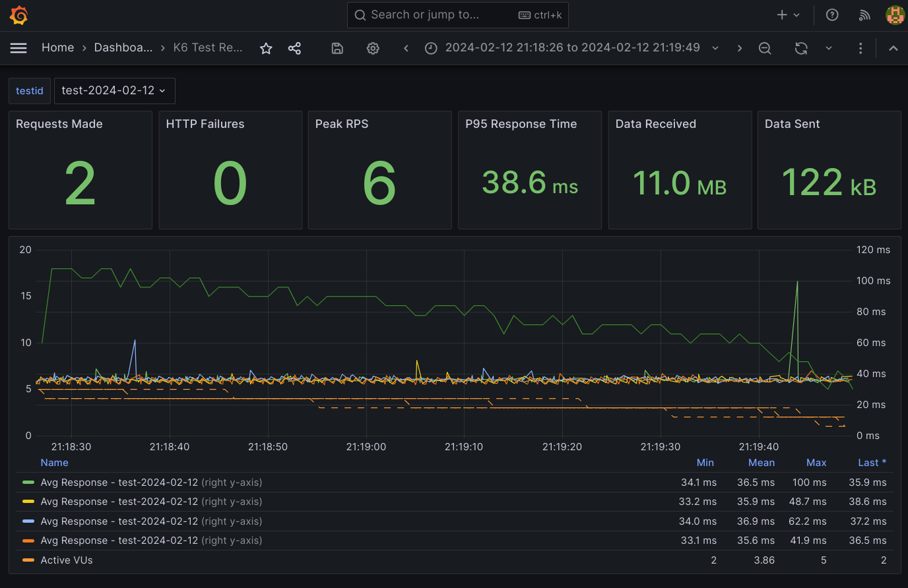

# k6-load-test-realtime

Este repositório contém os recursos para a instalação do k6 em um cluster kubernetes com um dashboard grafana configurado.

O k6 não disponibiliza no seu runner a integração com o influxdb v2. Entretanto isso está disponível por uma extensão.
 
O arquivo  `k6-influxdb.dockerfile` cria um runner com o k6 e o influxdb. 
Caso deseje fazer o build do runner, use o comando abaixo adequando ao seu cenário:
```bash
docker build -f k6-influxdb.dockerfile -t mycloudlab/k6-influxdb:0.48.0 .
```

Foi disponibilizada a imagem: `mycloudlab/k6-influxdb:0.48.0` que tem o objetivo de ser usada como runner no k6-operator.

## Instalação

Nota: Esta é uma instalação persistente, caso não tenha interesse em usar persistent volume, ajuste os yamls adequadamente.

1º Instale o operador no kubernetes do k6: 

```bash
curl https://raw.githubusercontent.com/grafana/k6-operator/main/bundle.yaml | kubectl apply -f -
```

2º Ajuste o arquivo de rota, configurando o host esperado:
```yaml
...
spec:
  host: grafana.xpto.com.br
...
```

3º Instale as playbooks que instala o influxdb e o grafana já com os dashboards configurados:

```bash
kubectl apply -f k8s-resources/ -n <SEU NAMESPACE>
```

Nota: Usuário e senha do grafana: `admin / admin`.


Com isso agora o cluster é capaz de reconhecer objetos do tipo `TestRun`.

## Rodando um teste

Dentro do repositório fornecemos o script `test.js` que serve como um exemplo para um teste do k6. 

1º Para executar ele dentro do cluster, criamos um config-map que conterá nosso script de teste.

```bash
kubectl create configmap scenarios-test --from-file test.js -n <SEU NAMESPACE> 
```

A execução é feita criando um recurso do tipo `TestRun`, o arquivo `k6-resource.yaml` contém um exemplo executável que deve ser ajustado para o cenário de teste desejado. Para a demonstração ele é suficiente.

```bash
kubectl create -f k6-resource.yaml -n <SEU NAMESPACE>
```

Com isso podemos ver no grafana o dashboard com o teste em execução:




### Referências

- https://grafana.com/docs/k6/latest/results-output/real-time/influxdb/
- https://grafana.com/blog/2022/06/23/running-distributed-load-tests-on-kubernetes/
